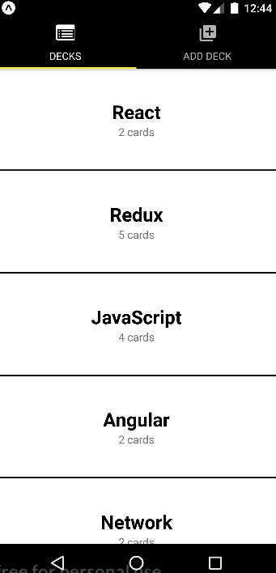

# Flashcards 

Mobile application that allows users to study collections of flashcards. 
The app allows users to create different categories of flashcards called "decks", edit and delete this desks, 
add flashcards to those decks, edit and remove flashcards from decks, then take quizzes on those decks.
It also sets reminder in case if user has not started quiz in a day. 

## Views

Dashboard view:

You can find screenshots of other views [here](./readme_img/VIEWS.md). 

## Run

To start this project install all required dependencies by running command:

`npm install`

To start dev server run:

`npm start`
 
To start in android emulator run:

`npm run android`

It will require android emulator to be up and running

### Android emulator

One of the possible ways:
 - install android studio and download required SDK versions
 - create environment variable ANDROID_SDK_ROOT with value of android SDK's location
 - add to path environment variable path to platform-tools (%ANDROID_SDK_ROOT%\platform-tools) 
 - install genymotion and specify path to android SDK's (settings -> ADB -> Use custom Android SDK Tools)
 - add in genymotion device you want to emulate and run it 
 - run `npm run android`
 
 
 ### Run on mobile device
 
  - install exp module (`npm install -g exp`)
  - run `exp build:android` (`exp build:ios` for ios device)
  - follow asked questions
  - install on mobile device expo app
  - open expo app and scan qr code generated by exp 

Project is created using create-react-native-app For more information please refer to [Create React Native App](https://github.com/react-community/create-react-native-app).

## License

This project is under [MIT License](https://opensource.org/licenses/MIT)