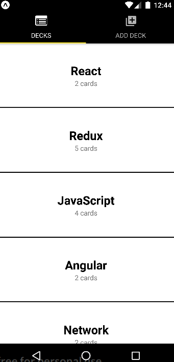

# Flashcards Views

## Dashboard

It has two tabs, first with deck list, second with add deck view.
Clicking on deck will navigate to devck details

## Add Deck

View for creating new deck

## Deck details

It has following buttons:
 - click on pen icon will navigate to deck renaming view
 - click on remove icon will ask for deck delete confirmation
 - click on cards text will navigate to cards list view
 - click on add card will navigate to add new card view
 - click on start quiz (available only if deck have any questions) will navigate to quiz view 

## Add card

Asks for question and answer of new flashcard

## Card list

Displays all flashcards list for deck, clicking on concrete flashcard navigate to card edit view
Clicking on remove icon will ask for card delete confirmation
 

## Quiz

You can see questions with two buttons for correct and incorrect answer, and clicking on flashcard will 
flip it and show answer
After all questions it shows score screen with percentage of correct answers

